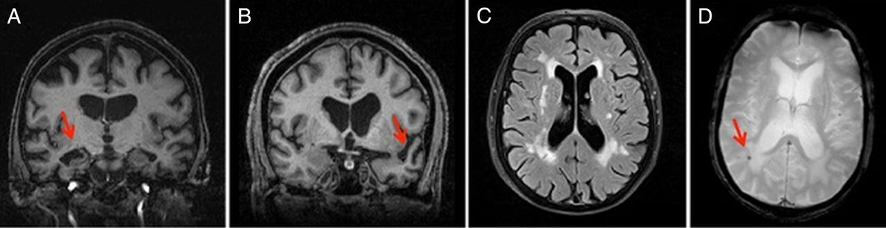

```{r setup, include=FALSE}
knitr::opts_chunk$set(echo = FALSE,
                      warning = FALSE,
                      message = FALSE)
```


```{r pkg}
library(tidyverse)      # tidying data and summarizing
library(dplyr)          # tidying and merging datasets
library(factoextra)     # for PCA visualization 
library(GGally)         # PCA visualization
library(recipes)        # PCA preparation and visualization
library(ggplot2)        # PCA plotting
library(tidytext)       # PCA plotting
library(corrr)          # Correlation matrix 
library(formattable)    # Correlation matrix table
```

<center>



</center>


<div style="text-align: right"> [@Bonifacio2016-vi] (https://pmj.bmj.com/content/92/1088/333) </div>

# 1 Introduction 
Dementia is a syndrome and includes many different neurodegenerative brain disorders, triggered by disease of the brain and causing loss of brain function [@Dening2015-pp]. 1 in 6 people over the age of 80 have dementia, which currently there is no cure for. Symptoms of dementia vary from physical to behavioral, including agitation and depression, as well as the well known symptoms being depleting memory and cognitive function [@Cerejeira2012-qr; @Shih2014-op]. Researchers are interested in the differences between demented and non-demented individuals, which is where the data being used in this report stems from. The data being analyzed includes subjects with or without dementia, and also subjects who developed dementia through the course of the study. The objective of my analysis hopes to group and tidy the data gathered from the research done on these subjects. The analysis is done through **R** [@R-base] and presented using **R markdown** with a html output [@R-rmarkdown]. 


# 2 Methods

## 2.1 Data Description
There are two separate CSV files: [patient_data_raw.csv](../data_raw/patient_data_raw.csv) and [visit_data_raw.csv](../data_raw/visit_data_raw.csv).

Researchers collected this data with the aim of predicting dementia rating and grouping. The files include data on 150 subjects, 88 females and 62 males, all between the ages if 60 and 96 years old. Multiple records for the same subject indicates following visits at least a year on from the previous. For reference all subjects are right-handed. In the patient data, 

Each row is a subject and data from their individual visit. There are two data files and the column descriptions are as follows:

**Patient**

* Subject ID
* Group (demented, nondementded, converted)
    + demented subjects are demented throughout the study, as for nondemented. Subjects who were nondemented on their first visit and demented on following visits are characterized as converted 
* m_f indicates gender
* educ states the years of education of the subject
* ses is the 'socioeconomic status' as assessed by the Hollingshead Index of Social Position
    + This is classified into categories from 1 (highest status) to 5 (lowest status)

**Visit**

* Subject ID
* MRI number
* Visit indicates the number if visit
* Age
* mmse is the Mini-Mental State Examination score (0 = worst to 30 = best)
* cdr indicates the clinical dementia rating
    + 0 = no dementia, 0.5 = very mild Alzheimers disease, 1 = mild Alzheimers disease, 2 = moderate Alzheimers disease
* etiv is the estimated total intacranial volume measured in mm<sup>3</sup>
* nwbv is the normalized whole-brain volume, expressed as a percent of all voxels in the atlas-masked image that are labeled as gray or white matter by the automated tissue segmentation process
* asf is the Atlas scaling factor (unitless). It is a computed scaling factor which transforms native-space brain and skull to the atlas target 


```{r data-import}
# Creating file for the patient data
file_patient <- "../data_raw/patient_data_raw.csv"

patient <- read.csv(file_patient) %>%
  janitor::clean_names()

# Creating file for visit data
file_visit <- "../data_raw/visit_data_raw.csv"

visit <- read.csv(file_visit) %>%
  janitor::clean_names()
```


## 2.2 Data preparation and tidying
The raw data was imported into **R** [@R-base] where it was tidied, filtered using the **tidyverse** package [@R-tidyverse], and combined using the **dplyr** package [@R-dplyr] into a new data set, ['data'](../data_processed/combined_data.csv). Data from the 'visit' data set was filtered out for `mri_numer` as it held the same information as the `visit` column, which was preferred to be the kept column as it is numerical so posed as a better variable for future analysis through PCA and other visualizations. 


```{r checking structure, include = FALSE}
#checking data sets have any unnecessary columns and are able to be combined
str(visit)
# 373 obs and 9 variables
str(patient)
# 150 obs and 5 variables
```


```{r data filtering}
# mri_number and visit provide the same information (1-4)
# removing column mri_number as it is irrelevant
visit <- visit %>%
  select(-mri_number)
```


```{r dataset combining}
# combining both datasets and retaining all values
data <- dplyr::full_join(patient, visit, by = "subject_id")
```


```{r exporting modified data}
# saving 'data' as a csv in the data_processed file
write.csv(data, file = "../data_processed/combined_data.csv", row.names = FALSE)
```


## 2.3 Pairwise Plot Matrix 
Firstly, given that there are 12 variables (9 being numeric), a Pairwise Plot Matrix will be carried out to look at correlations between the variables. This requires using the **GGally** package [@GGally] and the GGally::ggpairs() function. The non-numeric variables will be excluded except for the 'group' variable indicating the dementia status of the subject, which will be shown through different colours. This can give an indication on relationships between variables and between the different grouping classes, and if there is any clustering.


## 2.4 Visualisation using Principal Components Analysis (PCA)
Principal Component Analysis was done on this data to summarize how the variables relate to one another, whilst also providing visualization of the multivariate dataset, identifying variables which can be considered as having no or little impact on the rest of the data.

To ensure proper running of the PCA, all NAs were removed from the data using the pipe operator `%>%` and predictors were centered and scaled. Removal of NA values meant the data was reduced from 373 to 354 imaging sessions. Following this, the **recipes** package was used [@Recipes] to prepare the data for the PCA, this included specifying the non-numeric columns that are to be excluded from the PCA, which was then assigned to a new data set `data_recipe`. Following on from this, data was tidied using the package **tidytext** [@Tidytext] into [data_pca](../data_processed/pca_data.csv), where the `value` column indicates the linear combination of weights for each variable contributing to that component, a tidier output than using the `stats::prcomp()` factor. 

Upon visualization of the PCA, principle components with the largest epigenvalues (PC1:5) were kept for further analysis. I looked into the variables that were contributing most to these through contribution plots which required the packages **ggplot2**, **factoextra** and **tidytext** and  [@ggplot2; @factoextra; @Tidytext].

I narrowed in on the first three principal components. To do this I needed the PCA loadings from `data_pca` to be in a wider format, which can be seen in the `pca_wider` data set. Plotting also required to incorporate PCA values from `data_recipe` back in using the `recipes::juice()` function from the **recipe** package [@Recipes]. PC1 was then plotted against PC2 in a biplot to visualize and confirm which components are important and see if demented subjects stood out and if so, which variables were most affecting it. From this, the same plot was created but between PC2 and PC3. 


``` {r pca prep, include = FALSE}
# removing all rows with NAs present in the data frame
data <- data %>% drop_na()
# Normalizing and centering all predictors 
data_recipe <-
  recipe(~., data = data) %>% 
  update_role(group, m_f, subject_id, new_role = "id") %>% 
  step_naomit(all_predictors()) %>% 
  step_normalize(all_predictors()) %>%
  step_pca(all_predictors(), id = "pca") %>% 
  prep()
# Tidying
data_pca <- 
  data_recipe %>% 
  tidy(id = "pca") 
# Observing the components and values 
data_pca
```


```{r exporting modified data 2}
# saving 'data_pca' as a csv in the data_processed file
write.csv(data_pca, file = "../data_processed/pca_data.csv", row.names = FALSE)
```


## 2.5 Correlation matrix
Correlation matrices are used to inspect the association between multiple variables at once. This data contains multiple numeric measurements that are correlated therefore, using the **corrr** package and the corrr::correlate() function [@corrr], I can analyze these correlations. This was saved as a new data set, [data_corr](../data_processed/corr_data.csv). This was then further visualised using a network plot. 


```{r correlation matrix prep}
data_corr <- data %>%
  dplyr::select(where(is.numeric)) %>%
  correlate() %>%
  rearrange()
```


# 3 Results


## 3.1 Pairwise plot matrix
There appears to be some diverseness in Socioeconomic status (ses) and normalized whole-brain volume (n_wbv) between the three groups, with the curves following different patterns. Converted subjects also appear to be older than demented and nondemented. Mini-Mental State Examination score (mmse) appears to show association between many of the variables, which can be seen by a gradient of blue to yellow to red scattering indicative of a gradient from demented to converted to nondemented. Many tiles look clustered which may indicate there are some variables having little impact on the other variables.


```{r pairwise plot matrix}
# carrying out pairwise plot matrix
pairwise_plot <- data %>%
  select(group, where(is.numeric)) %>% 
  GGally::ggpairs(aes(color = group),
                  upper = list(continuous = wrap("cor", size = 1.3)),
          columns = c("e_tiv", "educ", 
                      "visit", "age",
                      "cdr", "mmse",
                      "n_wbv", "ses",
                      "asf")) +
  scale_colour_manual(values = c("#E7B800", "#00AFBB", "tomato")) +
  scale_fill_manual(values = c("#E7B800", "#00AFBB", "tomato"))

# Saving to file
ggsave("figures/pairwise_plot.png", 
       plot = pairwise_plot, 
       device = "png",
       width = 5.8, 
       height = 5.5,
       units = "in",
       dpi = 300)

pairwise_plot
```
<!-- figure legend -->

Figure 3.1: Pairwise plot matrix showing the correlations between variables. Yellow, blue and red indicate converted, demented and nondemented subjects respectively. Created with the package **GGally** and **ggplot2** [@GGally; @ggplot2].

<!-- end of fig legend -->


## 3.2 Principal Components Analysis


### 3.2.1 Scree plot
A Scree plot was used to compare the sizes of the epigenvalues and determine the amount of components based on these sizes. Figure 3.2.1 uses the the data to examine how much variance each principal component accounts for through a percentage. The Scree plot shows PC1 explains roughly 30% of the explained variance. Principal components 6-9 explain less than 5% of the explained variance each.


``` {r scree plot}
# Using functions from the factoextra package 
# Carrying out principal component analysis 
pca <- data %>%
  select(-group, -m_f, -subject_id) %>%
  prcomp(scale. = TRUE)

# visualizing 
scree_plot <- fviz_eig(pca, 
         barfill = "tomato",
         barcolor = "tomato",
         linecolor = "black")

# Saving to file
ggsave("figures/scree_plot.png", 
       plot = scree_plot, 
       device = "png",
       width = 5.8, 
       height = 5.5,
       units = "in",
       dpi = 300)

scree_plot
```
<!-- figure legend -->

Figure 3.2.1: Scree plot showing the percentage of explanation of the Principal components. Created with the package **factoextra** [@factoextra]

<!-- end of fig legend -->


### 3.2.2 Variable Correlation Plot
*Figure 3.2.2* illustrates and allows observation of the variables in the PCA against PC1 and PC2. PC1 is responsible for 27.8% of the variance, and PC2 23.4%, which agrees with *Figure 3.2.1*. Estimated total intracranial volume (e_tiv) and education (educ) are the largest positive contributors to PC1. Clinical dementia rating (cdr) contributes the most to PC2, along with Socioeconomic status (ses) to a smaller degree.


```{r variable corrrelation plot}
# Creating a graph of the variables
var_corr_plot <- fviz_pca_var(pca,
             col.var = "contrib", # Colour variables by contributions to the PC
             gradient.cols = c("#00AFBB", "#E7B800", "#FC4E07"),
             repel = TRUE     # Avoids text overlapping
             )

# Saving to file
ggsave("figures/variable_corr_plot.png", 
       plot = var_corr_plot, 
       device = "png",
       width = 5.8, 
       height = 5.5,
       units = "in",
       dpi = 300)

var_corr_plot
```
<!-- figure legend -->

Figure 3.2.2: Plotting the variables of the PCA against PC1 and PC2. Colours indicate the degree of contribution of each variable on the principal component. Created with the package **factoextra** [@factoextra]

<!-- end of fig legend -->


### 3.2.3 Contribution Plot
*Figure 3.2.1* indicates Principal Components 1-5 are the most responsible for the variance from the PCA. In *Figure 3.2.3* I only focused on PC1:5. This confirms the findings from *Figure 3.2.2* that PC1 is mostly impacted Estimated total intracranial volume (e_tiv) and education (educ). PC2 is mostly explained by Clinical Dementia Rating (cdr). 


```{r PCA visualisation}
# Visualizing the components of the PCA. From here we can see what principal components are impacted by which variables the most
contribution_plot <- data_pca %>%
  mutate(terms = tidytext::reorder_within(terms, 
                                          abs(value), 
                                          component)) %>%
  filter(component %in% paste0("PC", 1:5)) %>%
  ggplot(aes(abs(value), terms, fill = value > 0)) +
  geom_col() +
  facet_wrap(~component, scales = "free_y") +
  tidytext::scale_y_reordered() +
  scale_fill_manual(values = c("#00AFBB", "tomato")) +
  labs(
    x = "Absolute value of contribution",
    y = NULL, fill = "Positive?"
  ) 

# Saving to file
ggsave("figures/contribution_plot.png", 
       plot = contribution_plot, 
       device = "png",
       width = 5.8, 
       height = 5.5,
       units = "in",
       dpi = 300)

contribution_plot
```
<!-- figure legend -->

Figure 3.2.3: Plot showing the contribution of each variable on the Principal Components 1:5 which are known to explain the most variance within the data. Created with the package **tidytext** and **ggplot2** [@Tidytext; @ggplot2].

<!-- end of fig legend -->


### 3.2.4 A closer look into PC1, PC2 and PC3
I examined how the data is distributed in the plane of the first two components, PC1 and PC2. Below show biplots, a combination of a score plot overlaid by a loading plot. In *Figure 3.2.4.1*, along the dimension of PC2, demented subjects stand out compared to non-demented and converted where there is a significant amount of overlap. Clinical dementia rating is shown to be important in PC2, which agrees with the figures above. Looking at *Figure 3.2.4.2*, where PC2 is being compared to PC3, it presents similar conclusions to the previous, including large divergence of the subjects with dementia and clinical dementia rating being important in PC2. The gradient of the group categories follows the PC2 dimensions in both cases; this is probably the case due to clinical dementia rating being a large factor in PC2, and also correlating with the groups, so subjects who fall under the demented category will have a higher clinical dementia rating, followed by converted, then nondemented subjects.


```{r plotting PC1 against PC2}
# I need to get the pca loadings into wider format
pca_wider <- data_pca %>% 
  tidyr::pivot_wider(names_from = component, id_cols = terms)

# define arrow style
arrow_style <- arrow(length = unit(.03, "inches"),
                     type = "closed")


pca_plot <-
  juice(data_recipe) %>%
  ggplot(aes(PC1, PC2)) +
  geom_point(aes(color = group, shape = group), 
             alpha = 0.8, 
             size = 2) +
  scale_colour_manual(values = c("tomato", "#E7B800", "#00AFBB")) 


biplot_1 <- pca_plot +
  geom_segment(data = pca_wider,
               aes(xend = PC1, yend = PC2), 
               x = 0, 
               y = 0,
               arrow = arrow_style) + 
  geom_text(data = pca_wider,
            aes(x = PC1, y = PC2, label = terms), 
            hjust = 0, 
            vjust = 1,
            size = 3, 
            color = 'black') 

ggsave("figures/biplot_1.png", 
       plot = biplot_1, 
       device = "png",
       width = 5.8, 
       height = 5.5,
       units = "in",
       dpi = 300)

biplot_1
```
<!-- figure legend -->

Figure 3.2.4.1: A biplot comparing Principal Components one and two. The different groups are separated out as indicated in the key. Created with the package **recipes** and **ggplot2** [@Recipes; @ggplot2].

<!-- end of fig legend -->


```{r plotting PC2 against PC3}
biplot_2 <- pca_plot %+% 
  aes(PC2, PC3) +
  geom_segment(data = pca_wider,
               aes(xend = PC2, yend = PC3), 
               x = 0, 
               y = 0,
               arrow = arrow_style) + 
  geom_text(data = pca_wider,
            aes(x = PC2, y = PC3, label = terms), 
            hjust = 0, 
            vjust = 1,
            size = 3, 
            color = 'black') 

ggsave("figures/biplot_2.png", 
       plot = biplot_2, 
       device = "png",
       width = 5.8, 
       height = 5.5,
       units = "in",
       dpi = 300)

biplot_2
```
<!-- figure legend -->

Figure 3.2.4.2: A biplot comparing Principal Components two and three. The different groups are separated out as indicated in the key. Created with the package **recipes** and **ggplot2** [@Recipes; @ggplot2].

<!-- end of fig legend -->


## 3.3 Correlation matrix
The table in *Figure 3.3.1* shows the largest positive relationship between Mini-Mental State Examination score (mmse) and normalized whole-brain volume (n_wbv). I would have expected to see clinical dementia rating (cdr) having a larger effect on the other variables.

The network plot in *Figure 3.3.2* uses clustering to easily illustrate which variables are closer/ further apart from one another. Atlas scaling factor (asf) and estimated total intracranial volume (e_tiv) are in close proximity and appear to have a strong negative relationship. This can also been seen to a slightly weaker extent between years of education (educ) and socioeconomic status (ses). 


```{r correlation matrix table}
data_corr %>%
  formattable(educ = color_tile("#DeF7E9", "#71CA97"))
```
<!-- figure legend -->

Figure 3.3.1: A table presenting the results from the correlation matrix. Created with the package **corrr** and **formattable** [@corrr; @formattable].

<!-- end of fig legend -->


```{r network plot}
network_plot <- data_corr %>% network_plot(min_cor = 0)

ggsave("figures/network_plot.png", 
       plot = network_plot, 
       device = "png",
       width = 5.8, 
       height = 5.5,
       units = "in",
       dpi = 300)

network_plot
```
<!-- figure legend -->

Figure 3.3.2: A network plot comparing the relationship and strenth between numerical variables. Strength of correlation displayed by the colour gradient. Created with the package **corrr** [@corrr].

<!-- end of fig legend -->


```{r exporting modified data 3}
# saving 'pca_wider' as a csv in the data_processed file
write.csv(pca_wider, file = "../data_processed/wider_pca.csv", row.names = FALSE)
# saving 'data_corr' as a csv in the data_processed file
write.csv(data_corr, file = "../data_processed/corr_data.csv", row.names = FALSE)
```


## Word count


```{r word count}
# Installing wordcountaddin
devtools::install_github("benmarwick/wordcountaddin", type = "source", dependencies = TRUE)
# Word count for Rmd file
wc_main_rmd <- wordcountaddin:::text_stats("Main.Rmd") [3] %>% 
  str_extract("[0-9]+") %>% 
  as.numeric()
# Word count for README
wc_readme <- wordcountaddin:::text_stats("../README.md") [3] %>% 
  str_extract("[0-9]+") %>% 
  as.numeric()
```


This document: `r wc_main_rmd`\
README: `r wc_readme`\
**Total: `r wc_main_rmd + wc_readme`**

Calculated using **wordcountaddin** [@Marwick_undated-dd]. 

# References

